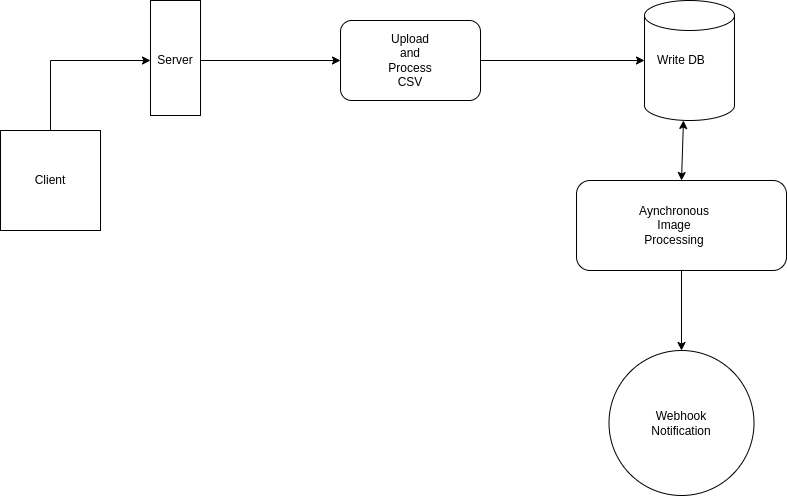

# Image Processing

This repository is about processing images asynchronously and notifying a third party when the processing is done.

## Installation

- Clone the project from GitHub
  
  ```
  git clone <repository_url>  
  ```
- Go into folder
  
  ```
  cd <repository_url> 
  ```
- Make sure you have nodejs and mongodb installed, if not install it first.
  
  ```
  npm install
  ```
- add `.env.` file into root folder as well as create uploads folder to store your images. In .env file add your mongodb connection string and webhook url.
  
  ```
  PORT=<port>
  DB_CONNECTION_STRING=<your_mongo_db_connection_string>
  WEBHOOK_URL=<your_webhook_url>
  ```
- Now start server with `npm start` command

## High-level architecture




## Image Processing Service Interaction

- Get the CSV file of products from the client which will be having multiple images and will be parsed. Once server reads the CSV file it creates database entries for the same and processes images asynchronously. 

## Webhook Handling 

- Processes callbacks from the image processing service.

## Database Schema and Interaction

- Schema will contain serial number, product name, input urls array which we want to process, output urls array to store processed images, status of image-processing, requestID for particular CSV file.
- Stores entries created for products from the CSV file and tracks the status of each processing request.

## API Endpoints

- Upload API:
    - url: `localhost:<PORT>/api/upload`
    - method: `POST` 
    - request: CSV file
    - response: unique `requestID`
- Status API:
    - url: `localhost:<PORT>/api/status/:requestId`
    - method: `GET` 
    - request: `requestID` in params
    - response: Processing status for `requestID`

## Asynchronous Workers

- We used asynchronous behavious of javascript to process the images but it will be a bottleneck for the system as more requests comes for processing.
- We tried to use BullMQ we will push the code for the same soon. 
- One more thing can cause an issue which is images itself. We can store images on blob-store (e.g. AWS-S3) instead of storing images as it is.
